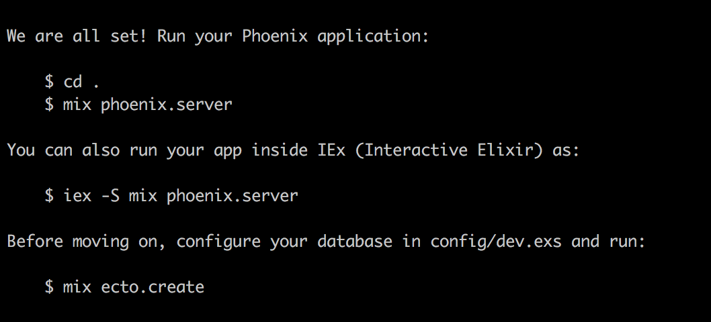
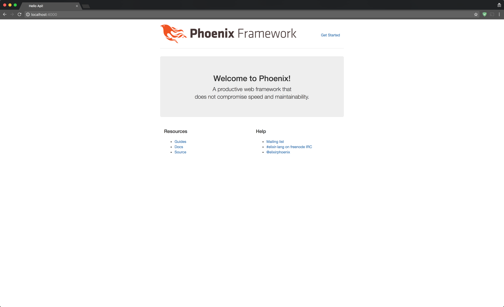

# Dockerized Phoenix seed project

Setting up a dockerized Phoenix webb-app requires jumping through some hoops and it's easy to forget a step or two in the chain. This repo comes with a pre-configured DockerFile and docker-compose.yml ready to go.

To start developing a new Dockerized Phoenix webb-app, simply fork this repo and follow the instructions below

## Create a elixir phoenix webb-app

```
# Create the docker container for your new Phoenix app
docker-compose up -d web
```

```
# Create a phoenix project in the Docker container. (mix phoenix.new PATH --app APP)
docker-compose run web mix phoenix.new . --app app
```

You will be prompted to overwrite ```config/dev.exs``` and ```config/test.exs``` as well as installing dependencies.
Respond Yes (Y) to all and then overwrite the database config with the configs that were included in the seed config files.
This should result in a newly created phoenix app:



```
# Manually configure your database in config/dev.exs if needed and run:
docker-compose run web mix ecto.create && mix ecto.migrate
```

**remember to rename the 'app' tags, as well as the DB config in the config/dev.exs and config/test.exs with the real app name**

## Running the environment
We should now have a Dockerized Phoenix application which is ready to run.
Here is a generic checklist gotten from (http://davidanguita.name/articles/dockerizing-a-phoenix-project/) to get everything up and running.

### Development environment

```
# Build the Docker image and start the `web` container, daemonized
docker-compose up -d web
```

```
# Install application's dependencies and compile them all
docker-compose run web mix do deps.get, compile
```

```
# Install (mostly) JS dependencies through `npm`
docker-compose run web npm config set strict-ssl false && npm install
```

```
# Execute the seeding script, if needed
docker-compose run web mix run priv/repo/seeds.exs
```

```
# Restart the `web` container to ensure everything's up
docker-compose restart web
```

Your application should just be reachable at http://localhost:4000/ 🎉



### Test environment

To run execute our tests we need to run the test container.

```
# Execute all tests (It's a `$ mix test` actually)
docker-compose run test
```

```
# Execute tests for specific files
docker-compose run test mix test test/models/user_test.exs
```

## Extra

You are now ready to start coding on your Phoenix web-app.

If it is your first time experimenting with the Phoenix framework I would recommend the following guide to easily get started with adding new endpoints. (https://robots.thoughtbot.com/building-a-phoenix-json-api)

Good luck!
